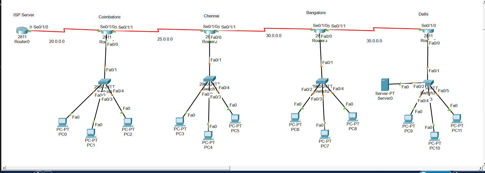
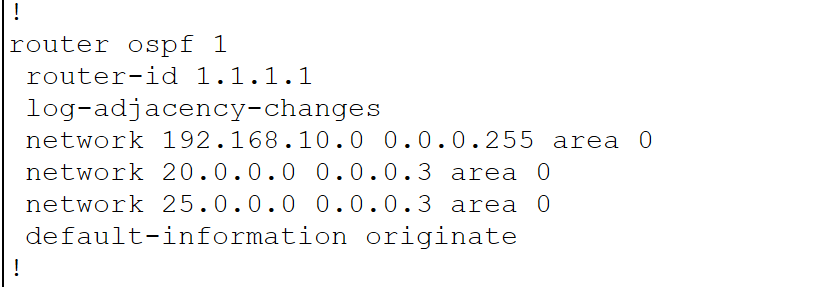
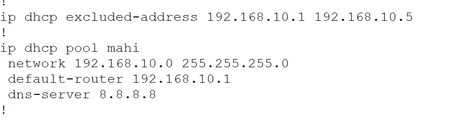

# secure-enterprise-network
Enterprise network simulation using OSPF, DHCP, and SSH security in Cisco Packet Tracer.
# Secure Enterprise Network Design

## Project Overview

Designed and simulated a secure enterprise network using Cisco Packet Tracer to establish communication between multiple branches.

## Technologies Used

* OSPF Routing
* DHCP
* SSH Security
* FTP Services
* Email Services

## Features

* Dynamic routing using OSPF
* Automatic IP allocation using DHCP
* Secure remote access using SSH
* FTP and email communication testing

## Tools Used

* Cisco Packet Tracer

## Project Objective

To design a secure and scalable enterprise network infrastructure with routing, security, and communication services.

## Network Components

* Routers
* Switches
* PCs
* Servers

## Outcome

Successfully simulated secure communication between multiple network branches and validated network functionality through connectivity testing.

## Screenshots

### Network Topology

### OSPF Configuration

### DHCP Configuration

### SSH Configuration

### Email Communication Test

